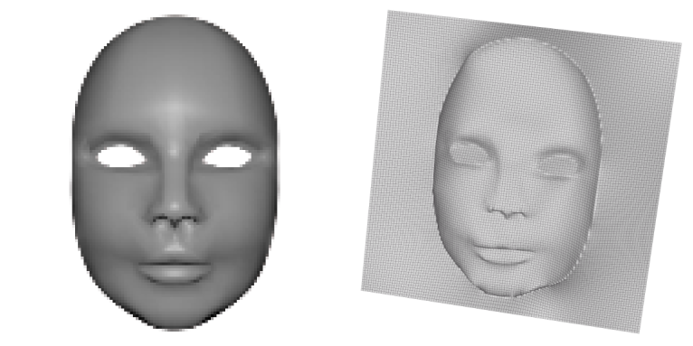
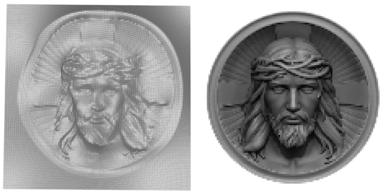

# Shape from shading

## TODO
##### Othmane
- [ ] Enlever le template sur la class Vecteur
- [ ] Implementer une matrice "sparse de Matlab" diagonale
- [ ] Commenter le code
- [ ] Essayer l'option sur BFGS

##### Achraf
- [ ] Génération d'images ($sin^2$) 
- [ ] Initialisation bombée de la matrice $h$
- [ ] Slides pour la soutenance
- [ ] Génération des résultats et commentaires

##### Karim
- [ ] Description de la modélisation du problème (lumière, équations, etc)
- [ ] Méthode d'optimisation (LBFGS, implémentation)

## Preview





---

## Description
Find a code allowing you to transform your image into a 3D surface.
#### Librairies

- Algorithme BFGS

#### Installation

Install Vizir to Visualize the result

## Compile

```
g++ -o main -Iinclude -Isrc src/main.cpp src/matrice.cpp src/conversion_image_matrice.cpp
```

g++ src/main.cpp src/conversion_image_matrice.cpp src/matrice.cpp src/vecteur.cpp src/lbfgs.cpp -o main.exe

## Remarques
Les images a fort contraste ne convergent pas. En général l'algorithme converge mieux avec un fond blanc.

## Les Limites
### Problèmes de symétrie
L'algorithme choisit un peu aléatoirement entre convexité et concavité.
